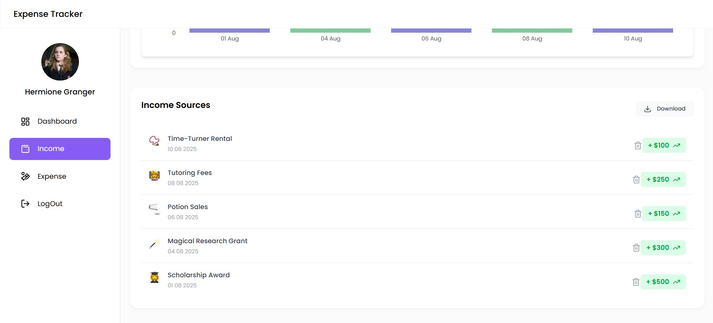

# mern-expense-tracker

## About

The `mern-expense-tracker` is a web-based application designed to help users manage their finances effectively. Built using the MERN stack (MongoDB, Express.js, React, Node.js), this application allows users to track their income and expenses, visualize spending patterns, and maintain a balanced budget. The interface offers an intuitive dashboard featuring expense and income overviews, recent transactions, and a comprehensive financial summary.

### Features
- **Expense Tracking**: Log and categorize expenses (e.g., Quidditch Supplies, Potion Ingredients, Book Purchases) with dates and amounts.
- **Income Management**: Record various income sources (e.g., Time-Turner Rental, Tutoring Fees, Magical Research Grant) with dates and amounts.
- **Visual Insights**: View expense and income trends over time through line and bar charts, and a pie chart for a financial overview.
- **Dashboard**: Centralized view of total balance, total income, and total expenses for the last 60 days.
- **User-Friendly Interface**: Designed for easy navigation with options to add new expenses or income and download transaction data.

### Screenshots
- **Signup Page**:
  

- **Login Page**:
  
  
- **Dashboard Page**:
  
  
  
  
- **Income Page**:
  
  

- **Expense Page**:
  
  

### Usage
1. **Sign In**: Access the application with your credentials.
2. **Navigate**: Use the sidebar to switch between Dashboard, Income, and Expense sections.
3. **Add Transactions**: Click "+ Add Expense" or "+ Add Income" to log new entries.
4. **Analyze**: Review charts and lists to manage your finances.
5. **Download**: Export your transaction data for records.

### Installation
1. Clone the repository:
   ```bash
   git clone https://github.com/samadhirs/mern-expense-tracker.git
   ```
2. Navigate to the project directory:
   ```bash
   cd mern-expense-tracker
   ```
3. Install dependencies:
   ```bash
   npm install
   ```
4. Set up environment variables (e.g., MongoDB URI) in a `.env` file.
5. Start the application:
   ```bash
   npm start
   ```

### Contributing
Contributions are welcome! Please fork the repository and submit pull requests for any enhancements or bug fixes.
